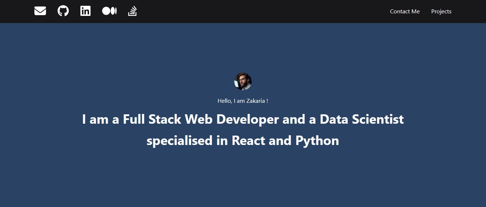
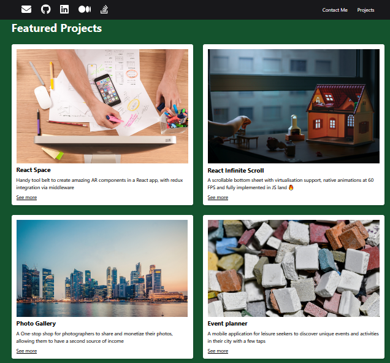
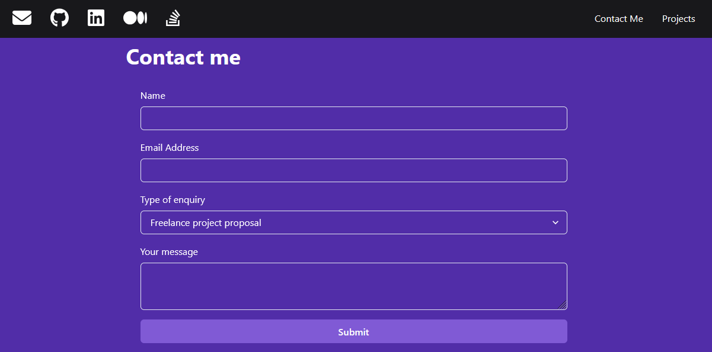

# 🌟 Advanced React Portfolio Project 🌟

## 🌐 Overview

Welcome to my **Advanced React Portfolio Project**. This elegant React-based portfolio showcases my skills and projects in a visually appealing and interactive manner. Designed with a clean and user-friendly interface.

*Screenshot of the Advanced React Portfolio Project*

*The Featured Projects Section*

*The Contact me Section*

## 🎨 Features

- **Dynamic Project Showcase**: Each project is displayed with an image, title, and description, allowing visitors to explore my work in detail.
- **Responsive Design**: Optimized for various screen sizes, ensuring accessibility on all devices.
- **Smooth Navigation**: Intuitive navigation to easily access different sections of the portfolio.
- **Interactive Elements**: Engaging UI components that enhance user interaction.

## 📁 Project Structure

The project consists of the following files:

- **`package.json`**: Contains project metadata and dependencies.
- **`public/index.html`**: The main HTML file that serves the app.
- **`src/App.js`**: The main React component for the application.
- **`src/components/Card.js`**: Component for displaying individual project cards.
- **`src/components/ProjectsSection.js`**: Component for showcasing the projects section.
- **`src/styles.css`**: Styles for the application.

## 📜 License

This project is available under the **MIT License**. 
